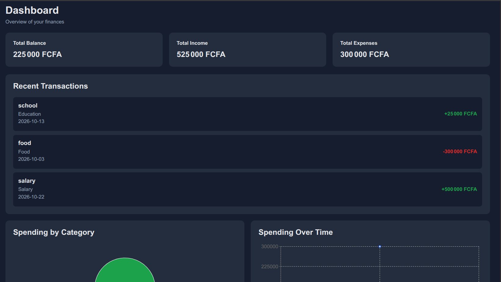

# 💰 Expense & Budget Tracker

> A responsive personal finance web application built with React that helps users track income and expenses, organize transactions by category, manage monthly budgets, visualize spending, and keep financial data saved across sessions.

---

## 📌 Problem Statement

Managing personal finances can become difficult when income, expenses, and monthly budgets are tracked manually.

This project provides a simple and interactive solution for recording financial transactions, organizing expenses into categories, setting monthly budgets, monitoring spending, and understanding financial activity through charts.

The application was also built to strengthen practical React development skills, including components, React Router, Context API, custom hooks, state management, localStorage, responsive design, and data visualization.

---

## 🎯 Project Goals

* Build a responsive personal finance application
* Record and manage income and expenses
* Organize transactions using categories
* Create and manage monthly budgets
* Track spending against budget limits
* Display financial summaries on a dashboard
* Visualize spending using charts
* Persist application data using localStorage
* Implement light and dark themes
* Practice reusable React components and custom hooks
* Build a clean and user-friendly interface

---

## 🛠 Tech Stack

### Frontend

* React
* JavaScript (ES6+)
* HTML5
* CSS3

### Libraries

* React Router
* Lucide React
* Recharts

### Development Tools

* Vite
* Git & GitHub
* VS Code
* ESLint

---

## 🖥 Features

### 📊 Dashboard

* Total balance
* Total income
* Total expenses
* Recent transactions
* Spending by category chart
* Spending over time chart
* Empty states when no financial data is available

### 💳 Transactions

* Add income and expenses
* Edit existing transactions
* Delete transactions with confirmation
* Positive amounts for income
* Negative amounts for expenses
* Transaction descriptions
* Categories
* Dates
* Optional notes
* Newest transactions displayed first

### 🔎 Transaction Filters

* Filter by month
* Filter by transaction type
* Filter by category
* Search transaction notes
* Debounced search input
* Clear all filters

### 🏷 Categories

* Default financial categories
* Create custom categories
* Assign custom colors
* Delete categories
* Use categories across transactions and budgets

### 💰 Budgets

* Create monthly category budgets
* Update an existing budget for the same category and month
* Display total budget
* Display amount spent
* Display remaining amount
* Visual budget progress bars
* Warning when approaching the budget limit
* Warning when spending exceeds the budget

### 📈 Charts

* Spending by category using a pie chart
* Spending over time using a line chart
* Empty states when there is no spending data

### 🌙 Theme

* Light mode
* Dark mode
* Theme preference saved using localStorage
* Theme remains active after refreshing the page

### 💾 Data Persistence

Application data is stored in the browser using `localStorage`.

The following data persists across page refreshes:

* Transactions
* Categories
* Budgets
* Theme preference

### 💱 Currency

All financial amounts are displayed using **FCFA (XAF)**.

The application uses JavaScript's `Intl.NumberFormat` API to format monetary values.

### 📱 Responsive Design

The application is designed to work across:

* Desktop screens
* Tablets
* Mobile devices

---

## 📸 Screenshot



---

## ⚙ Installation & Setup

### 📥 Clone the repository

```bash
git clone git@github.com:Hache-premier/expense-budget-tracker.git
cd expense-budget-tracker
